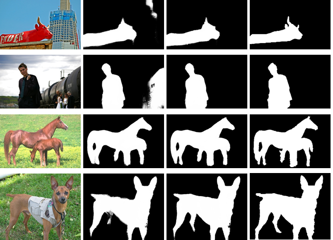

# Advsal
A general python framework for training and testing SODGAN, based on **PyTorch**.
  
This release also includes many **new features**, including:  
* Multi GPU training (we don't have done it for now, we will update)
* PyTorch v1.3 support  

 
## Highlights

### SODGAN network

### [Training Framework: LTR](train)
 
**LTR** is a general framework for training SODGAN network.

## trainers
The toolkit contains the implementation of the following methods.

### SODGAN

Official implementation of the **SODGAN** network. SODGAN is two-stage training architecture, which can accelerate training speed. And it takes only 35 minutes to train on a Titan Xp GPU. Our model can detect salient objects better.


 

## [Model Zoo](https://drive.google.com/open?id=1T2h3e1QZkapyKGrImdG9nBvLUchdHgYU)
The models trained using PyTorch.
Your can download trained well models [model zoo](https://drive.google.com/open?id=1T2h3e1QZkapyKGrImdG9nBvLUchdHgYU). 


## Installation

#### Clone the GIT repository.  
```bash
git clone https://github.com/yongwuSHU/Advsal.git
```
   
#### Install dependencies
* PyTorch >=0.4.1 (we have tested PyTorch v1.3 with Python 3.7)
* Python 3
* ubuntu 16.04 (we don't recommend OS 18.04)
* You need install [pydensecrf](https://github.com/lucasb-eyer/pydensecrf.git)

## Let's start !
### Training
Activate the right environment and run it.  
```bash
python training.py sodgan    
```  
### Testing
Activate the right environment and run it
```bash
python testing.py sodgan --dataset pascal(ecssd....)
```
## Contributors

* [Yong Wu](http://www.ivp.shu.edu.cn/) Any comments, please email: Yong_Wu1@163.com, Yong_Wu@shu.edu.cn
