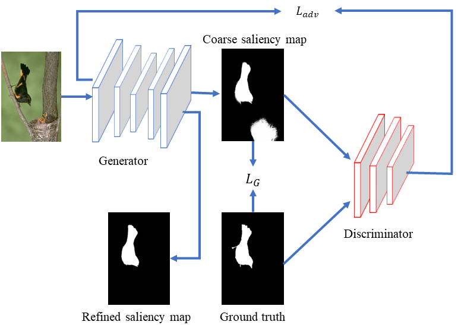

# Advsal
A general python framework for training and testing SODGAN, based on **PyTorch**.
  
This release also includes many **new features**, including:  
* Multi-GPU training（You need to retrain the model for first training step）
* PyTorch v1.3 support  

 
## Highlights

### SODGAN network

### [Training Framework: LTR](train)
 
**LTR** is a general framework for training SODGAN network.

## trainers
The toolkit contains the implementation of the following methods.

## Publication and citation

SODGAN is proposed in our paper accepted by JVCIR 2020. 
Detailed explanation of our method can be found in the paper:

```
@article{wuadvsal2020,
  author={Yong Wu and Zhi Liu and Xiaofei Zhou}, 
  title = {Saliency detection using adversarial learning networks},
  journal = J. Vis. Commun. Image Represent,
  volume = {67},
  pages={102761},
  year = {2020},
  month={Feb.},
}
```
The paper can be downloaded [here](https://doi.org/10.1016/j.jvcir.2020.102761).


### SODGAN

Official implementation of the **SODGAN** network. SODGAN is two-stage training architecture, which can accelerate training speed. And it takes only 35 minutes to train on a Titan Xp GPU. Our model can detect salient objects better.


 

## [Model Zoo](https://drive.google.com/open?id=1T2h3e1QZkapyKGrImdG9nBvLUchdHgYU)
The models trained using PyTorch.
Your can download trained well models [model zoo](https://drive.google.com/open?id=1T2h3e1QZkapyKGrImdG9nBvLUchdHgYU). 


## Installation

#### Clone the GIT repository.  
```bash
git clone https://github.com/yongwuSHU/Advsal.git
```
   
#### Install dependencies
* PyTorch >=0.4.1 (we have tested PyTorch v1.3 with Python 3.7)
* Python 3
* Ubuntu 16.04 (we don't recommend OS 18.04)
* You need to install [pydensecrf](https://github.com/lucasb-eyer/pydensecrf.git)
* You can download the [resnet101](https://drive.google.com/file/d/15d1e04lCGq6-SeJS8DIai8duqqRUipzU/view?usp=sharing) model

## Let's start !
### Training
Activate the right environment and run it.  
```bash
python training.py sodgan    
```  
### Testing
Activate the right environment and run it
```bash
python testing.py sodgan --dataset pascal(ecssd,hkuis,dutste,dutomron,....)
```
## Contributors

* [Yong Wu](http://www.ivp.shu.edu.cn/) 

Any question, please email: yong_wu1@163.com, yong_wu@shu.edu.cn
